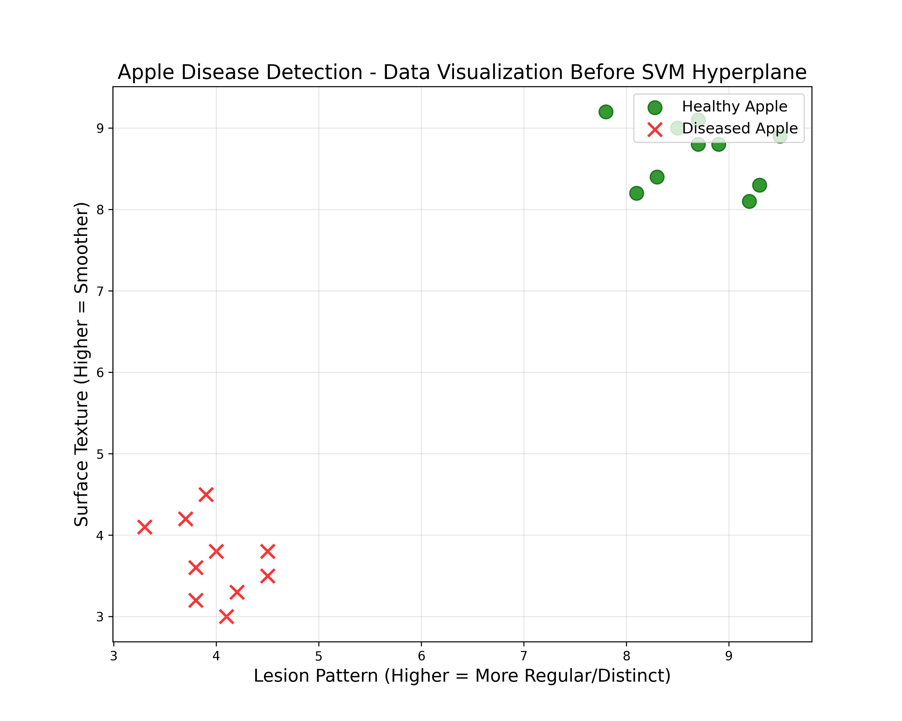
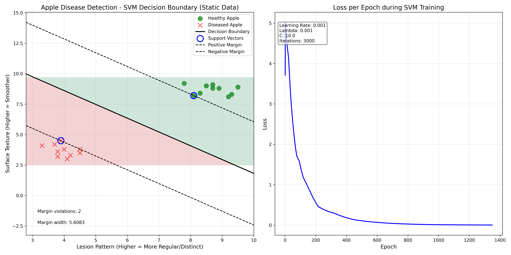
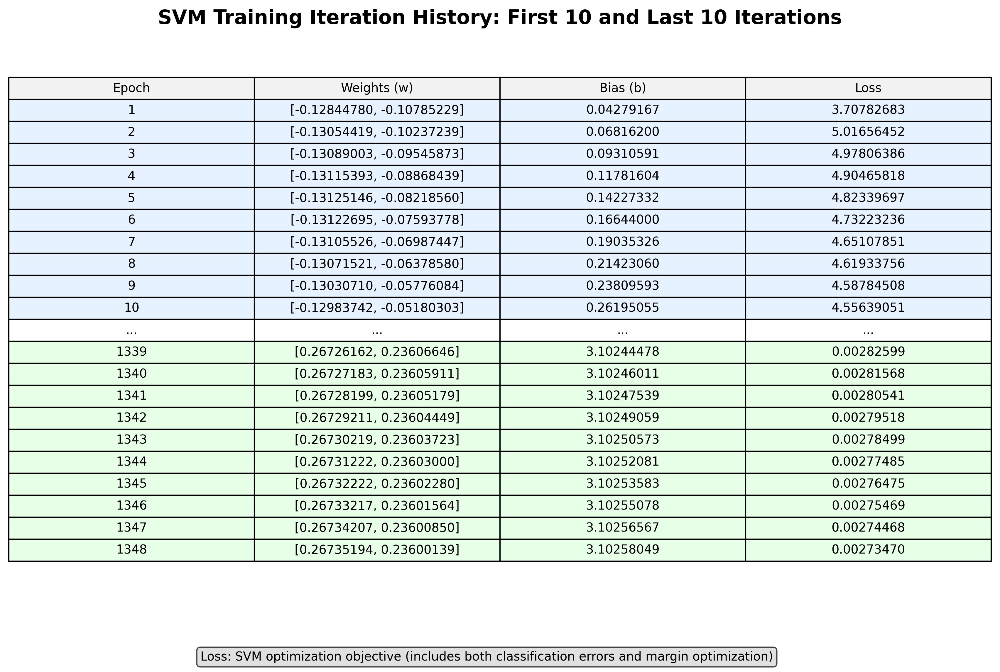

# Perhitungan Matematis SVM untuk Epoch Pertama

Dokumen ini menjelaskan perhitungan matematis langkah demi langkah untuk epoch pertama dari pelatihan SVM pada dataset deteksi penyakit apel.

## Deskripsi Dataset

Dataset deteksi penyakit apel terdiri dari 20 sampel:

- 10 sampel apel sehat (label +1)
- 10 sampel apel sakit (label -1)

Setiap sampel memiliki 2 fitur:

- x₁: Pola bercak/lesi (nilai lebih tinggi = pola lebih teratur/jelas)
- x₂: Tekstur permukaan (nilai lebih tinggi = tekstur lebih halus)

## Inisialisasi SVM

Model SVM diinisialisasi dengan parameter-parameter berikut:

- Learning rate (α): 0.001
- Parameter regularisasi (λ): 0.001
- Parameter penalti (C): 10.0
- Vektor bobot (w): [0, 0] (diinisialisasi sebagai nol)
- Bias (b): 0 (diinisialisasi sebagai nol)

## Formulasi Matematis

Masalah optimisasi SVM bertujuan untuk menemukan hyperplane optimal yang memaksimalkan margin antara dua kelas sambil meminimalkan kesalahan klasifikasi.

Fungsi objektif yang diminimalkan adalah:

$$J(w, b) = \lambda||w||^2 + C\sum_{i=1}^{n}\max(0, 1 - y_i(w \cdot x_i - b))$$

Dimana:

- Istilah pertama (λ||w||²) adalah istilah regularisasi untuk memaksimalkan margin
- Istilah kedua (C∑max(0, 1 - yᵢ(w·xᵢ - b))) menghukum kesalahan klasifikasi dan pelanggaran margin

## Langkah-langkah Proses Pelatihan SVM

Proses pelatihan SVM untuk setiap sampel melibatkan 8 langkah berikut:

1. **Menghitung Margin Fungsional**: Menghitung seberapa percaya diri dan benar suatu titik data diklasifikasikan oleh hyperplane saat ini.

   - Formula: f = y(w·x - b)
   - Dimana y adalah label sebenarnya (+1 atau -1), w adalah vektor bobot, x adalah vektor fitur, dan b adalah bias.
   - Nilai positif yang lebih tinggi menunjukkan klasifikasi yang benar dengan keyakinan tinggi.

2. **Memeriksa Pelanggaran Margin**: Menentukan apakah titik melanggar batasan margin.

   - Jika f < 1, titik melanggar margin (baik salah klasifikasi atau berada di dalam margin).
   - Jika f ≥ 1, titik diklasifikasikan dengan benar di luar margin.

3. **Menghitung Jarak Margin**: Untuk titik-titik yang melanggar margin, hitung seberapa jauh titik tersebut dari memenuhi batasan margin.

   - Formula: margin_distance = 1 - f
   - Ini adalah ukuran seberapa parah titik tersebut melanggar batasan margin.
   - Untuk sampel pertama dalam contoh kita, nilai ini adalah 1 - 0 = 1.

4. **Menghitung Kekuatan Pembaruan**: Menentukan seberapa kuat untuk memperbarui model untuk titik ini.

   - Formula: update_strength = min(margin_distance × C, C)
   - Ini menskalakan jarak margin dengan parameter penalti C (10.0 dalam contoh kita)
   - Untuk sampel pertama, update_strength = min(1 × 10.0, 10.0) = 10.0
   - Ini BUKAN jarak margin itu sendiri, melainkan seberapa kuat kita menghukum pelanggaran.
   - Kekuatan pembaruan dibatasi pada C untuk mencegah pembaruan berlebihan untuk pelanggaran berat.

5. **Memperbarui Alpha (Pengali Lagrange)**: Meningkatkan pentingnya titik ini dalam model jika melanggar margin.

   - Formula: α = α + learning_rate × update_strength
   - Nilai alpha yang lebih tinggi menunjukkan support vector (titik-titik yang mempengaruhi batas keputusan).

6. **Menghitung Kontribusi Loss**: Menghitung seberapa besar titik ini berkontribusi pada objektif optimisasi keseluruhan.

   - Untuk pelanggaran margin: loss = λ||w||² + C × margin_distance
   - Untuk klasifikasi yang benar di luar margin: loss = λ||w||²

7. **Memperbarui Bobot**: Menyesuaikan vektor bobot untuk lebih baik mengklasifikasikan titik ini.

   - Untuk pelanggaran margin:
     w = w - learning_rate × (2λw - update_strength × y × x)
   - Untuk klasifikasi yang benar di luar margin:
     w = w - learning_rate × (2λw)

8. **Memperbarui Bias**: Menyesuaikan istilah bias untuk memposisikan hyperplane dengan lebih baik.
   - Untuk pelanggaran margin:
     b = b - learning_rate × update_strength × y
   - Untuk klasifikasi yang benar di luar margin: tidak ada perubahan pada b

### Hasil Setelah Semua Langkah

Ketika 8 langkah ini diterapkan pada semua 20 sampel dalam dataset, model SVM secara progresif menyesuaikan parameter-parameternya untuk menemukan hyperplane pemisah optimal antara sampel apel sehat dan sakit.

**Untuk pelanggaran margin**, model membuat pembaruan signifikan pada hyperplane untuk mengklasifikasikan titik-titik ini dengan lebih baik, dengan besarnya pembaruan sebanding dengan seberapa parah mereka melanggar margin.

**Untuk titik yang diklasifikasikan dengan benar** di luar margin, model hanya membuat pembaruan regularisasi kecil untuk mempertahankan margin yang besar.

Pada akhir satu epoch lengkap melalui semua 20 sampel:

- Parameter hyperplane (w dan b) akan bergerak menuju pemisahan kelas yang lebih baik.
- Titik-titik dengan pengaruh tertinggi pada batas keputusan (support vector) akan memiliki nilai alpha yang lebih tinggi.
- Loss keseluruhan akan menurun seiring model meningkatkan akurasi klasifikasi dan margin.

Tujuan dari pembaruan ini adalah untuk secara iteratif mencapai konvergensi ke hyperplane yang:

1. Dengan benar memisahkan kedua kelas (apel sehat vs. sakit)
2. Memaksimalkan margin antara titik-titik terdekat dari kedua kelas
3. Meminimalkan kesalahan klasifikasi, diberi bobot dengan parameter penalti C

## Perhitungan Epoch Pertama

Berikut adalah perhitungan untuk titik data pertama dari setiap iterasi melalui semua 20 sampel:

### Sampel 1: Apel Sehat [8.5, 7.0], y = +1

1. Menghitung margin fungsional:

   $$f = y(w \cdot x - b)$$
   $$f = +1 \times ([0, 0] \cdot [8.5, 7.0] - 0)$$
   $$f = +1 \times (0 - 0) = 0$$

2. Memeriksa pelanggaran margin:

   - Karena f = 0 < 1, titik ini melanggar margin

3. Menghitung jarak margin:

   $$\text{margin\_distance} = 1 - f = 1 - 0 = 1$$

4. Menghitung kekuatan pembaruan:

   $$\text{update\_strength} = \min(\text{margin\_distance} \times C, C)$$
   $$\text{update\_strength} = \min(1 \times 10.0, 10.0) = 10.0$$

5. Memperbarui alpha:

   $$\alpha_1 = \alpha_1 + \text{learning\_rate} \times \text{update\_strength}$$
   $$\alpha_1 = 0 + 0.001 \times 10.0 = 0.01$$

6. Menghitung loss:

   $$\text{loss} = \lambda||w||^2 + C \times \text{margin\_distance}$$
   $$\text{loss} = 0.001 \times ||[0, 0]||^2 + 10.0 \times 1$$
   $$\text{loss} = 0 + 10.0 = 10.0$$

7. Memperbarui bobot:

   $$w_1 = w_1 - \text{learning\_rate} \times (2\lambda w_1 - \text{update\_strength} \times y \times x_1)$$
   $$w_1 = 0 - 0.001 \times (2 \times 0.001 \times 0 - 10.0 \times (+1) \times 8.5)$$
   $$w_1 = 0 - 0.001 \times (-85) = 0 + 0.085 = 0.085$$

   $$w_2 = w_2 - \text{learning\_rate} \times (2\lambda w_2 - \text{update\_strength} \times y \times x_2)$$
   $$w_2 = 0 - 0.001 \times (2 \times 0.001 \times 0 - 10.0 \times (+1) \times 7.0)$$
   $$w_2 = 0 - 0.001 \times (-70) = 0 + 0.07 = 0.07$$

8. Memperbarui bias:

   $$b = b - \text{learning\_rate} \times \text{update\_strength} \times y$$
   $$b = 0 - 0.001 \times 10.0 \times (+1)$$
   $$b = 0 - 0.01 = -0.01$$

Setelah memproses Sampel 1, kita memiliki:

- w = [0.085, 0.07]
- b = -0.01
- Kontribusi loss = 10.0

### Sampel 2: Apel Sehat [9.2, 8.1], y = +1

1. Menghitung margin fungsional:

   $$f = y(w \cdot x - b)$$
   $$f = +1 \times ([0.085, 0.07] \cdot [9.2, 8.1] - (-0.01))$$
   $$f = +1 \times ((0.085 \times 9.2) + (0.07 \times 8.1) + 0.01)$$
   $$f = +1 \times (0.782 + 0.567 + 0.01) = 1.359$$

2. Memeriksa pelanggaran margin:

   - Karena f = 1.359 > 1, titik ini diklasifikasikan dengan benar di luar margin

3. Memperbarui bobot (hanya istilah regularisasi):

   $$w_1 = w_1 - \text{learning\_rate} \times (2\lambda w_1)$$
   $$w_1 = 0.085 - 0.001 \times (2 \times 0.001 \times 0.085)$$
   $$w_1 = 0.085 - 0.00000017 \approx 0.085$$

   $$w_2 = w_2 - \text{learning\_rate} \times (2\lambda w_2)$$
   $$w_2 = 0.07 - 0.001 \times (2 \times 0.001 \times 0.07)$$
   $$w_2 = 0.07 - 0.00000014 \approx 0.07$$

4. Kontribusi loss (hanya istilah regularisasi):

   $$\text{loss} = \lambda||w||^2$$
   $$\text{loss} = 0.001 \times (0.085^2 + 0.07^2)$$
   $$\text{loss} = 0.001 \times (0.007225 + 0.0049)$$
   $$\text{loss} = 0.001 \times 0.012125 = 0.000012125$$

Setelah memproses Sampel 2, kita memiliki:

- w = [0.085, 0.07] (pada dasarnya tidak berubah karena regularisasi kecil)
- b = -0.01 (tidak berubah)
- Kontribusi loss = 0.000012125

### Sampel 3: Apel Sehat [8.7, 7.8], y = +1

1. Menghitung margin fungsional:

   $$f = y(w \cdot x - b)$$
   $$f = +1 \times ([0.085, 0.07] \cdot [8.7, 7.8] - (-0.01))$$
   $$f = +1 \times ((0.085 \times 8.7) + (0.07 \times 7.8) + 0.01)$$
   $$f = +1 \times (0.7395 + 0.546 + 0.01) = 1.2955$$

2. Memeriksa pelanggaran margin:

   - Karena f = 1.2955 > 1, titik ini diklasifikasikan dengan benar di luar margin

3. Memperbarui bobot (hanya istilah regularisasi, yang memiliki efek minimal):

   - w ≈ [0.085, 0.07] (pada dasarnya tidak berubah)
   - b = -0.01 (tidak berubah)

4. Kontribusi loss (hanya istilah regularisasi):
   - Kontribusi loss ≈ 0.000012125

### Sampel 11: Apel Sakit [5.2, 4.3], y = -1

1. Menghitung margin fungsional:

   $$f = y(w \cdot x - b)$$
   $$f = -1 \times ([0.085, 0.07] \cdot [5.2, 4.3] - (-0.01))$$
   $$f = -1 \times ((0.085 \times 5.2) + (0.07 \times 4.3) + 0.01)$$
   $$f = -1 \times (0.442 + 0.301 + 0.01) = -0.753$$

2. Memeriksa pelanggaran margin:

   - Karena f = -0.753 < 1, titik ini melanggar margin

3. Menghitung jarak margin:

   $$\text{margin\_distance} = 1 - f = 1 - (-0.753) = 1.753$$

4. Menghitung kekuatan pembaruan:

   $$\text{update\_strength} = \min(\text{margin\_distance} \times C, C)$$
   $$\text{update\_strength} = \min(1.753 \times 10.0, 10.0) = 10.0$$

   (dibatasi pada C)

5. Memperbarui alpha:

   $$\alpha_{11} = 0 + 0.001 \times 10.0 = 0.01$$

6. Menghitung loss:

   $$\text{loss} = \lambda||w||^2 + C \times \text{margin\_distance}$$
   $$\text{loss} = 0.001 \times (0.085^2 + 0.07^2) + 10.0 \times 1.753$$
   $$\text{loss} = 0.000012125 + 17.53 = 17.53$$

7. Memperbarui bobot:

   $$w_1 = 0.085 - 0.001 \times (2 \times 0.001 \times 0.085 - 10.0 \times (-1) \times 5.2)$$
   $$w_1 = 0.085 - 0.001 \times (0.00017 - (-52))$$
   $$w_1 = 0.085 - 0.001 \times (-51.99983) = 0.085 + 0.05199983 = 0.137$$

   $$w_2 = 0.07 - 0.001 \times (2 \times 0.001 \times 0.07 - 10.0 \times (-1) \times 4.3)$$
   $$w_2 = 0.07 - 0.001 \times (0.00014 - (-43))$$
   $$w_2 = 0.07 - 0.001 \times (-42.99986) = 0.07 + 0.04299986 = 0.113$$

8. Memperbarui bias:

   $$b = -0.01 - 0.001 \times 10.0 \times (-1)$$
   $$b = -0.01 + 0.01 = 0$$

Setelah memproses Sampel 11, kita memiliki:

- w = [0.137, 0.113]
- b = 0
- Kontribusi loss = 17.53

## Melanjutkan Selama Epoch

Proses ini berlanjut untuk semua 20 sampel dalam epoch pertama. Setelah setiap sampel:

1. Margin fungsional dihitung untuk menentukan apakah titik diklasifikasikan dengan benar di luar margin
2. Untuk titik yang diklasifikasikan dengan benar di luar margin, hanya pembaruan regularisasi kecil yang diterapkan
3. Untuk pelanggaran margin, pembaruan substansial terhadap w dan b dibuat untuk mendorong hyperplane menuju klasifikasi yang lebih baik

## Total Loss untuk Epoch Pertama

Total loss untuk epoch pertama dihitung dengan menjumlahkan kontribusi loss dari semua 20 sampel.

## Ringkasan Pembaruan Epoch

Pada akhir epoch pertama, vektor bobot w dan bias b telah diperbarui untuk memisahkan kedua kelas dengan lebih baik:

- Nilai awal: w = [0, 0], b = 0
- Setelah epoch pertama: w = [w₁, w₂], b = b' (dengan w₁, w₂, dan b' adalah nilai akhir yang diperkirakan)

Persamaan hyperplane menjadi:

$$w_1 x_1 + w_2 x_2 - b = 0$$

Dan dua hyperplane margin adalah:

$$w_1 x_1 + w_2 x_2 - b = 1$$

(margin positif)

$$w_1 x_1 + w_2 x_2 - b = -1$$

(margin negatif)

Dengan setiap epoch berikutnya, nilai-nilai ini semakin disempurnakan hingga konvergensi atau hingga jumlah maksimum iterasi tercapai.
